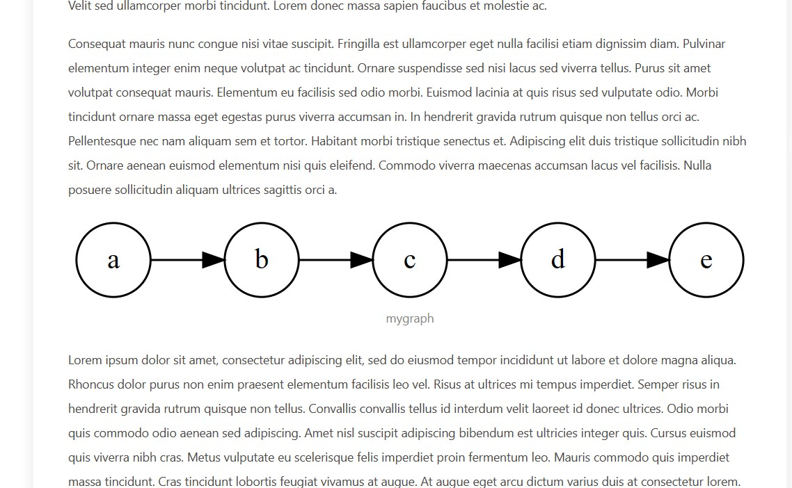
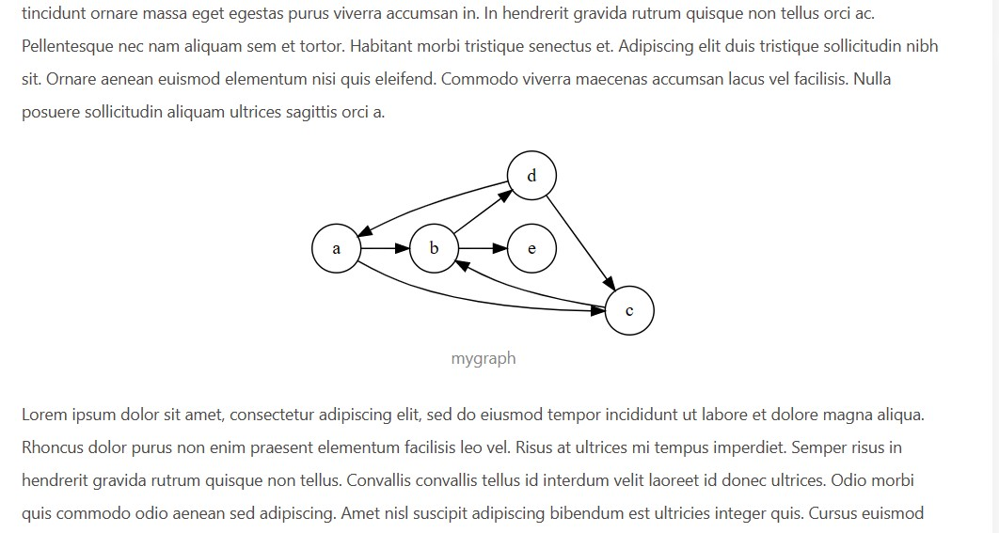
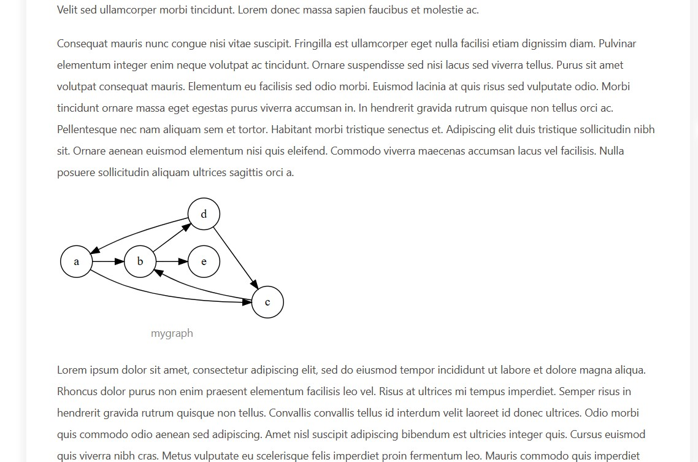
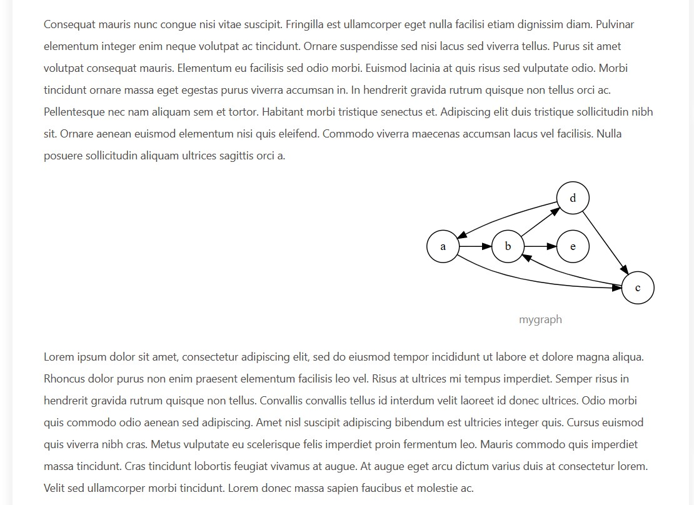

# hexo-tag-graphviz
A hexo plugin to add graphviz graphs in hexo blog using tags.

In the process of blogging, sometimes you need to draw pictures. For example, when writing a blog related to graph theory, you need to draw a directed or undirected graph. Using `graphviz` is a good choice.

This plugin allows users to write `dot` language directly in the blog, without having to write locally and then generate pictures.

## Instructions
installation method:
```bash
npm i hexo-graphviz-tag
```
It was originally called `hexo-tag-graphviz`, but when it was released, it was found that `hexo-tag-graphviz` already existed, so it was renamed to `hexo-graphviz-tag`, so the name on github is different from the name on npm.

After the installation is complete, you can use it the same as the general hexo tag plugin. The label plugin has three parameters, namely `title`, `align` and `maxWidth`.

If only one anonymous argument is provided, it defaults to the image title `title`, as shown below, defining a directed graph named `mygraph`.
```

digraph {
   rankdir = LR;
   node [shape=circle]
   a -> b;
   b -> c;
   c -> d;
   d -> e;
}

```
The display effect under the butterfly theme:


`maxWidth` can set the maximum width. The default unit is `px`. As shown below, a directed graph with a maximum width of `300px` is defined.
```

digraph {
   rankdir = LR;
   node [shape=circle]
   a -> b;
   b -> d;
   c -> b;
   d -> a;
   d -> c;
   a -> c;
   b -> e;
}

```

The `align` parameter can set the alignment of the image. There are three alignment methods, namely `center`, `left` and `right`, where `center` is the default alignment.

Align left:
```

digraph {
   rankdir = LR;
   node [shape=circle]
   a -> b;
   b -> d;
   c -> b;
   d -> a;
   d -> c;
   a -> c;
   b -> e;
}

```

Align right:
```

digraph {
   rankdir = LR;
   node [shape=circle]
   a -> b;
   b -> d;
   c -> b;
   d -> a;
   d -> c;
   a -> c;
   b -> e;
}

```
