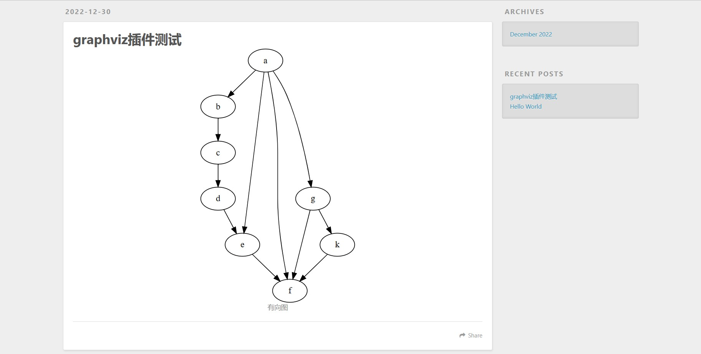
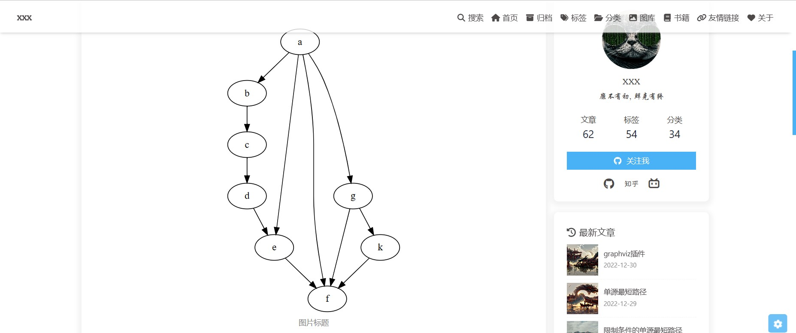

# hexo-tag-graphviz
一个hexo插件，使用标签在hexo博客中添加graphviz图。
[english](README.en.md)

在写博客的过程中，有时候会需要画图。比如说在写图论相关的博客的时候，需要画有向图或者无向图。使用 `graphviz` 是一个不错的选择。

该插件使得用户可以直接在博客中编写 `dot` 语言，而无需在本地编写然后生成图片。

## 使用方法
安装方法:
```bash
npm i hexo-graphviz-tag
```
安装完成后，就可以和使用一般的hexo标签插件一样来使用它。该标签插件仅有一个参数，即图像的标题。
```

digraph {
    a -> b;
    b -> c;
    c -> d;
    d -> e;
    a -> e;
    a -> f;
    a -> g;
    g -> f;
    g -> k;
    k -> f;
    e -> f;
}

```
hexo默认主题下的效果:

butterfly主题下的效果


