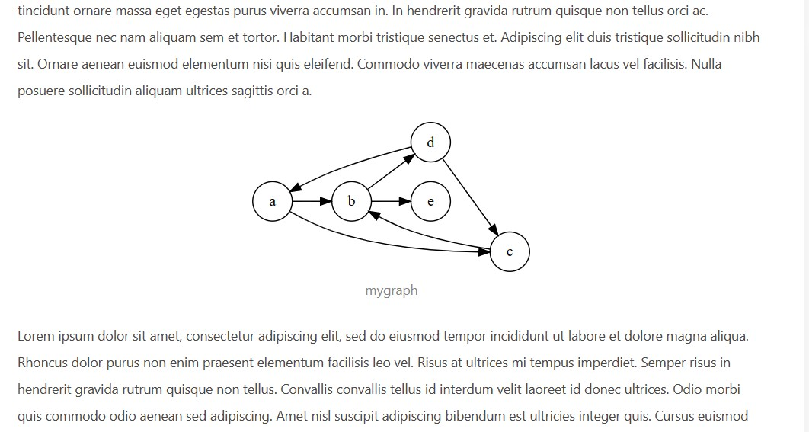
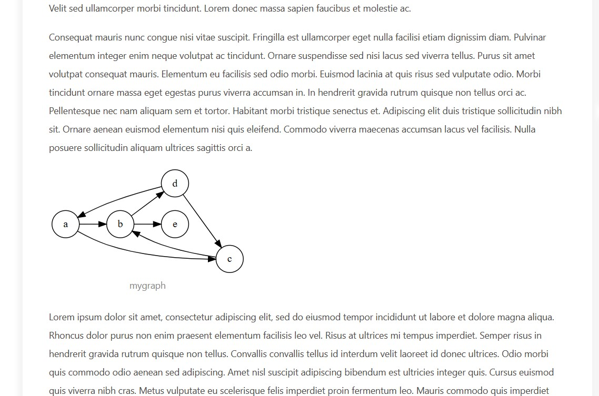

# hexo-tag-graphviz
一个hexo插件，使用标签在hexo博客中添加graphviz图。

[English](README.en.md)

在写博客的过程中，有时候会需要画图。比如说在写图论相关的博客的时候，需要画有向图或者无向图。使用 `graphviz` 是一个不错的选择。

该插件使得用户可以直接在博客中编写 `dot` 语言，而无需在本地编写然后生成图片。

## 使用方法
安装方法:
```bash
npm i hexo-graphviz-tag
```
本来取名叫 `hexo-tag-graphviz`，发布时发现 `hexo-tag-graphviz` 已经存在，遂改名为 `hexo-graphviz-tag`，因此 github 上的名称和 npm 上的名称不同。

安装完成后，就可以和使用一般的hexo标签插件一样来使用它。该标签插件有三个参数，分别是`title`、`align` 和 `maxWidth` 。

如果仅提供一个匿名参数，则默认为图像标题 `title`，如下所示，定义了一个名为 `mygraph` 的有向图。
```

digraph {
  rankdir = LR;
  node [shape=circle]
  a -> b;
  b -> c;
  c -> d;
  d -> e;
}

```
butterfly主题下的显示效果:


`maxWidth`可以设置最大宽度。默认单位是 `px`。如下所示，定义了一个最大宽度为 `300px` 的有向图。
```

digraph {
  rankdir = LR;
  node [shape=circle]
  a -> b;
  b -> d;
  c -> b;
  d -> a;
  d -> c;
  a -> c;
  b -> e;
}

```

`align`参数可以设置图像的对齐方式，有三种对齐方式，分别为 `center`、`left` 和 `right`，其中 `center` 是默认对齐方式。 

左对齐:
```

digraph {
  rankdir = LR;
  node [shape=circle]
  a -> b;
  b -> d;
  c -> b;
  d -> a;
  d -> c;
  a -> c;
  b -> e;
}

```

右对齐:
```

digraph {
  rankdir = LR;
  node [shape=circle]
  a -> b;
  b -> d;
  c -> b;
  d -> a;
  d -> c;
  a -> c;
  b -> e;
}

```

